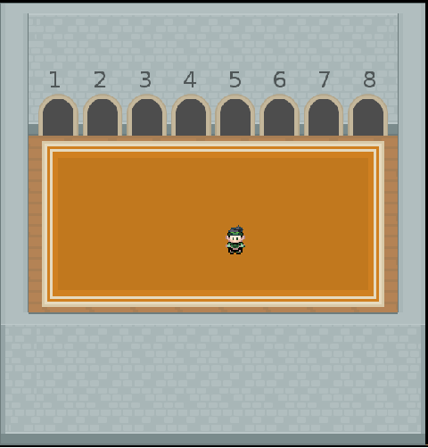
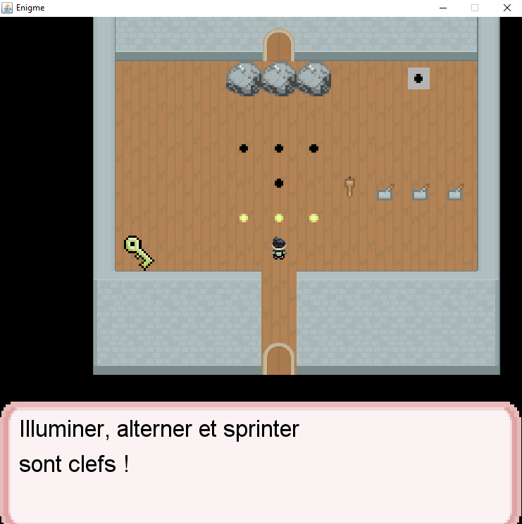
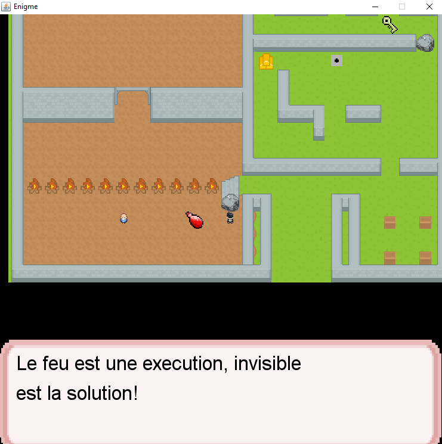

# 2D_Game
->Description:

WELCOME TO ENIGMA : A 2D GRID BASED GAME
 
(Alan Turing likes this.) 

_________________________HOW TO LAUNCH_?________________________

	     To launch the game run the Play file

___________________________CONTROLS?___________________________

	A: Pause
	L: Do a View Interaction

__________________________WALKTHROUGH?__________________________

   > LVL 2
  - Get close to the Apple
  - Tap L to eat the apple 

  > LVL 3
  - To open the door, get close to the key and tap L.
  - To make the first Rock disappear, light up the torch or change the levers 
    to the mentionned position (unlocked-locked-unlocked)
  - To make the second Rock disappear, go on the pressure plate. It will make the rock disappear
    for few seconds.
  - To make the last rock disappear, open all the lights by just passing on them

    PS: We have changed the logic attributs of the second and third rock. It is due to the fact that lights are always 
    cligning, making the third rock disappearence not so trivial.   
    
  
  > LVL 4
   - If you go into the fire, the program will close instantly, because who can survive fire?
   - Take the potion in order to make the rock disappear
   - Take the gold in order to enjoy wealth 
   - Pass on the pressure plate in order to make the rock disappear
   - Take the key and you're back into the Level Selector
   - Enjoy the dynamic dialog  
 
 
 ->Images from the game:
 

 

  

 
  # ENJOY !   
